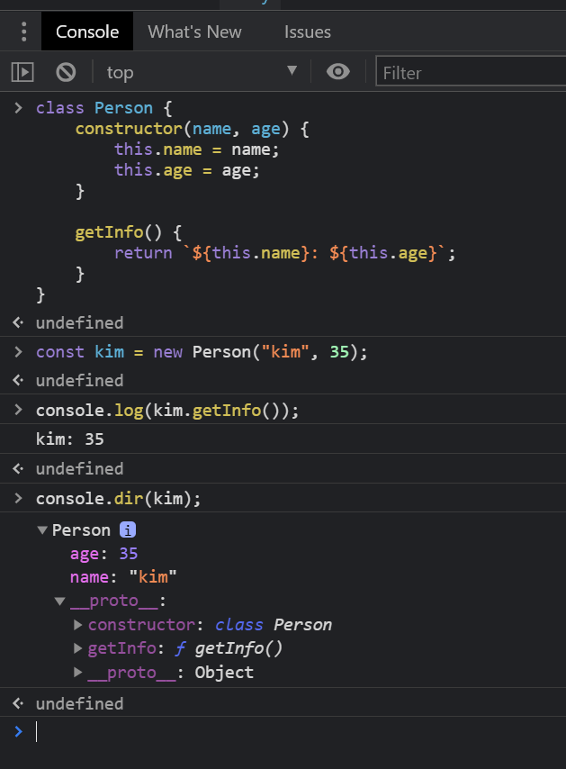
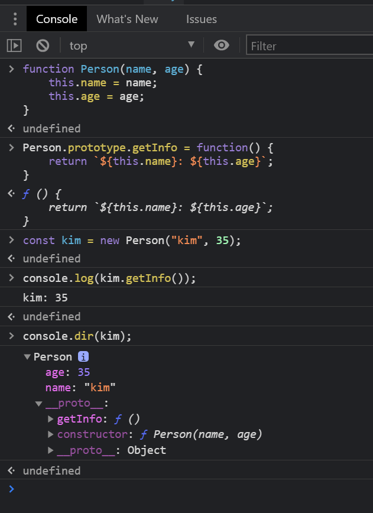
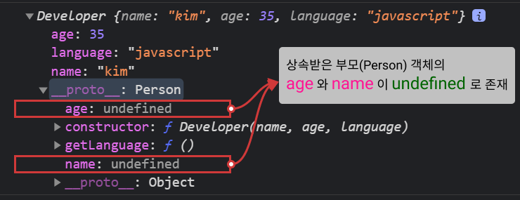
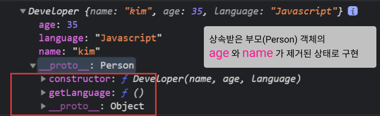
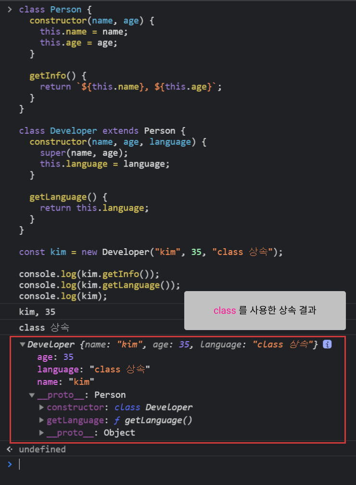
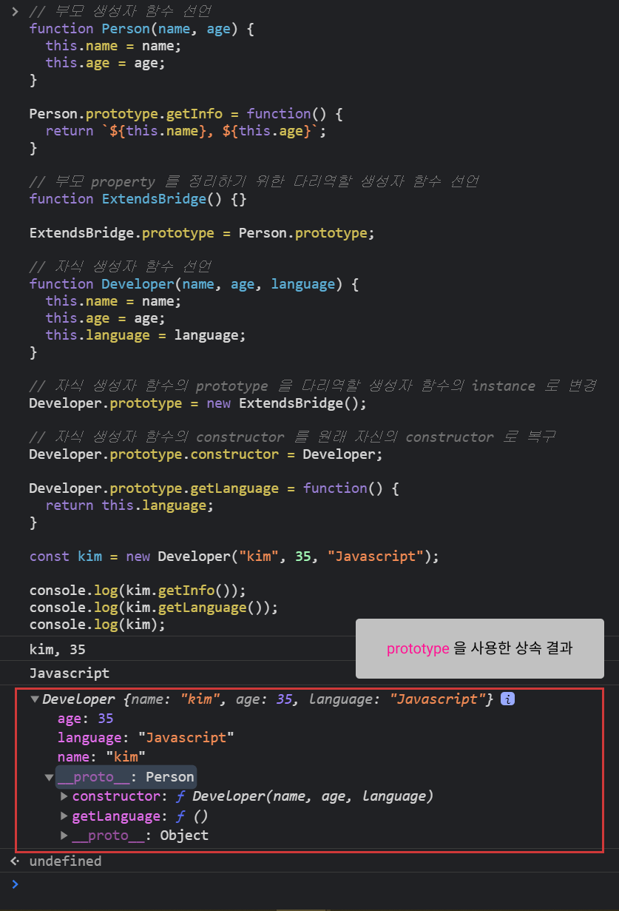

# 07 class

[🐫 돌아가기](https://github.com/Chocobe/-Study-FrontEnd-2021/tree/master/01-Javascript%20%ED%95%B5%EC%8B%AC%20%EA%B0%9C%EB%85%90%20%EC%95%8C%EC%95%84%EB%B3%B4%EA%B8%B0%20(2021.04.11%20%EC%8B%9C%EC%9E%91))

<br/>

객체지향 언어의 ``Class`` 문법 형식을, Javascript 의 ``Prototype`` 으로 동일하게 만들 수 있습니다.

``Prototype`` 으로 ``Class`` 처럼 만들기 위해서는 구현해야할 부분들이 있지만, 이러한 부분을 ``class`` 키워드로 간편하게 만들 수 있습니다.


<br/><br/>


## 1. ``class``

작성한 ``class`` 를 사용하여 객체를 생성할 수 있습니다.

다음은 ``class`` 작성 및 객체 생성 방법 입니다.

```javascript
// class 문법
class Person {
  constructor(name, age) {
    this.name = name;
    this.age = age;
  }

  getInfo() {
    return `${this.name}: ${this.age}`;
  }
}

const kim = new Person("kim", 35);
console.log(kim.getInfo()); // "kim: 35" 출력
```


<br/>

다음은 ``Prototype`` 으로 동일한 객체를 생성한 방법 입니다.

```javascript
function Person(name, age) {
  this.name = name;
  this.age = age;
}

Person.prototype.getInfo = function() {
  return `(proto) ${kim.getInfo()}`;
}

const kim = new Person("kim", 35);
console.log(kim.getInfo()); // "(proto) kim: 35" 출력
```

|class로 객체 생성|prototype 으로 객체 생성|
|:---:|:---:|
|<br/>|<br/>|


<br/><br/>


## 2. 상속

상속이 아닌 단일 ``class`` 는 ``prototype`` 과 동일 하였습니다.

하지만, ``prototype`` 으로 ``class`` 와 동일하도록 구현하려면 다음과 같은 처리가 필요 합니다.
  1. ``부모 class`` 에 해당하는 ``(부모)생성자 함수`` 작성
  2. ``자식 class`` 에 해당하는 ``(자식)생성자 함수`` 작성
  3. ``(부모)생성자 함수`` 와 ``(자식)생성자 함수`` 를 연결 시키기 위한 ``(중간)생성자 함수`` 작성

<br/>

위 처리가 필요한 이유는, 생성된 객체의 Property가 ``class`` 문법과 달리 ``super`` 키워드로 Parameter 를 넘겨줄 수 없기 때문입니다.

``Prototype`` 을 수정하지 않고, 상속형태를 작성하면, 상속 받은 객체(부모객체)에 ``잘못된 Property`` 가 생기게 됩니다.

```javascript
// Person 생성자 함수 선언
function Person(name, age) {
  this.name = name;
  this.age = age;
}

Person.prototype.getInfo = function() {
  return `${this.name}, ${this.age}`;
}

// Developer 생성자 함수 선언
function Developer(name, age, language) {
  this.name = name;
  this.age = age;
  this.language = language;
}

// Person 을 상속받은 효과를 위해, Developer.prototype 에 Person의 instance를 대입
Developer.prototype = new Person();

// Developer 의 원래 생성자 함수를 Developer 로 수정
Developer.prototype.constructor = Developer;

// Developer 의 메서드 생성
Developer.prototype.getLanguage = function() {
  return this.language;
}

const kim = new Developer("kim", 35, "Javascript");

console.log(kim.getInfo());
console.log(kim.getLanguage());
console.log(kim);
```

<br/>

위 예제를 브라우저에서 실행 시키면 다음과 같은 결과를 얻게 됩니다.

<br/>

<br/>

위 결과에서 상속받은 부모 객체의 ``name`` 과 ``age`` 를 제거된 상태로 ``Developer`` 의 ``prototype`` 에 대입되도록 수정해야 ``객체지향의 class`` 를 (유사)구현할 수 있습니다.

이를 구현하기 위해, 다음과 같은 과정을 추가해 줍니다.
1. Person 의 내부로직을 제외한, ``Person 의 prototype`` 만 가지는 ``새로운 생성자 함수`` 작성 (ExtendsBridge)
2. Developer 의 prototype 에 ``Person`` 의 instance 대신,  ``ExtendsBridge`` 의 instance 를 대입

<br/>

아래 코드는 상속을 구현한 최종 코드 입니다.

```javascript
// Person 생성자 함수 선언
function Person(name, age) {
  this.name = name;
  this.age = age;
}

Person.prototype.getInfo = function() {
  return `${this.name}, ${this.age}`;
}

// class 상속을 (유사)구현하기 위한 중간처리용 ``생성자 함수`` 선언 (Property를 가지지 않음)
function ExtendsBridge() {}
// ExtendsBridge 는 Person의 Property 는 가지지 않고, prototype 만 동일
ExtendsBridge.prototype = Person.prototype;

// Person 을 상속받을 자식 생성자 함수 선언
function Developer(name, age, language) {
  this.name = name;
  this.age = age;
  this.language = language;
}

// Developer 의 prototype 을 ExtendsBridge instance 로 대입
Developer.prototype = new ExtendsBridge();

// Developer 의 원래 생성자 함수를 Developer 로 다시 지정
Developer.prototype.constructor = Developer;

// Developer 의 메서드 정의
Developer.prototype.getLanguage = function() {
  return this.language;
}

const kim = new Developer("kim", 35, "Javascript");
console.log(kim.getInfo());
console.log(kim.getLanguage());
console.log(kim);
```

<br/>

위 코드를 브라우저에서 실행 시키면, 부모 객체의 ``name`` 과 ``age`` 가 깔끔하게 제거된 상태를 볼 수 있습니다.

<br/>


<br/><br/>


## 3. ``class`` 와 ``prototype`` 의 상속 비교

지금까지의 ``class`` 와 ``prototype`` 의 상속을 한눈에 비교해 보면 다음과 같습니다.

<br/>

<details>
<summary>class의 상속 코드보기</summary>

```javascript
// 부모 class 생성
class Person {
  constructor(name, age) {
    this.name = name;
    this.age = age;
  }

  getInfo() {
    return `${this.name}, ${this.age}`;
  }
}

// 자식 class 생성
class Developer extends Person {
  constructor(name, age, language) {
    super(name, age);
    this.language = language;
  }

  getLanguage() {
    return this.language;
  }
}

const kim = new Developer("kim", 35, "class 상속");

console.log(kim.getInfo());
console.log(kim.getLanguage());
console.log(kim);
```
</details>

<br/>

<details>
<summary>prototype의 상속 코드보기</summary>

```javascript
// 부모 생성자 함수 선언
function Person(name, age) {
  this.name = name;
  this.age = age;
}

Person.prototype.getInfo = function() {
  return `${this.name}, ${this.age}`;
}

// 부모 property 를 정리하기 위한 다리역할 생성자 함수 선언
function ExtendsBridge() {}

ExtendsBridge.prototype = Person.prototype;

// 자식 생성자 함수 선언
function Developer(name, age, language) {
  this.name = name;
  this.age = age;
  this.language = language;
}

// 자식 생성자 함수의 prototype 을 다리역할 생성자 함수의 instance 로 변경
Developer.prototype = new ExtendsBridge();

// 자식 생성자 함수의 constructor 를 원래 자신의 constructor 로 복구
Developer.prototype.constructor = Developer;

Developer.prototype.getLanguage = function() {
  return this.language;
}

const kim = new Developer("kim", 35, "Javascript");

console.log(kim.getInfo());
console.log(kim.getLanguage());
console.log(kim);
```
</details>

<br/>

|class 상속|prototype 상속|
|:---:|:---:|
|||