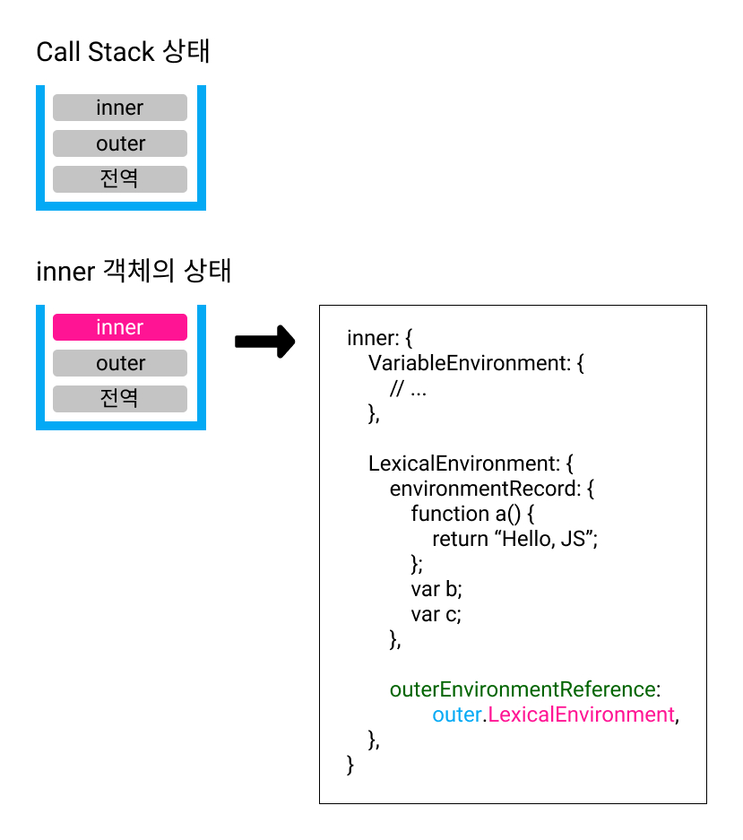

# 02. 실행 컨텍스트 (Execution Context)

[🐫 돌아가기](https://github.com/Chocobe/-Study-Javascript-ES5-2021)

<br/>

## 1. Execution Context

Context 는 ``역사적, 문화적, 지리적인 배경이 되는 조건`` 을 말합니다. (=== 건축용어)

프로그래밍 언어에서의 Execution Context는 ``프로그램을 실행할 때 필요한 (코드 흐름상의) 배경이 되는 조건/환경정보`` 를 말합니다.

<br/>

## Javascript 에서의 Execution Context는 ``함수`` 를 실행할 때 필요한 환경정보를 담은 객체를 말합니다.


<br/>


EX6+ 부터는 ``Block Scope`` 개념이 생겼습니다. (const, let)

``Block Scope``이 생기므로써 ``const`` 와 ``let`` 을 사용하게 되면, ``함수를 실행할 때 필요한 환경정보를 담은 객체``로 의미가 구체화 되었습니다.


<br/><br/>


## 2. Call Stack

현재 어떤 함수가 동작하고 있는지, 다음에 어떤 함수가 호출되어야 하는지 등을 제어하는 자료구조를 말합니다.

함수안에 함수를 호출할 경우 흐름은 다음과 같습니다.
1. 외부함수가 호출 됩니다.
2. 회부함수 안에서 내부함수가 호출 됩니다.
3. 내부함수가 완료되고, 내부함수를 빠져나갑니다.
4. 외부함수가 완료되고, 외부함수를 빠져나갑니다.

즉, 함수 호출의 동작은 Stack 자료구조와 동일한 방식으로 ``LIFO (Last in First out 후입선출)`` 방식으로 동작 합니다.

<br/>

Javascript 의 Execution Context는 다음과 같은 형식의 객체로 구성 됩니다.
```bash
  Execution Context ┬─ VariableEnvironment
                    │     ├─ environmentRecord (LexicalEnvironment 의 최초 스넵샷)
                    │     │     : 현재 문맥의 식별자 정보
                    │     └─ outerEnvironmentReference (LexicalEnvironment 의 최초 스넵샷)
                    │           : 외부 문맥의 식별자 정보
                    │
                    ├─ LexicalEnvironment
                    │     ├─ environmentRecord (현재 시점에서 변형된 상태)
                    │     │     : 현재 문맥의 식별자 정보
                    │     │     : === Hoisting
                    │     └─ outerEnvironmentReference (현재 시점에 변형된 상태값)
                    │           : 자신을 호출한 상위 Call Stack 의 참조 주소값
                    │           : === 외부 식별자
                    │           : === Scope Chain
                    │
                    └─ thisBindling
                          : 실행 컨텍스트가 열리는 순간 ``this`` 를 바인딩 합니다.
```


<br/><br/>


## 3. Hoisting

Hoisting 은 ``LexicalEnvironment.environmentRecord`` 가 수행하는 정보수집 과정을 가상으로 표현한 개념 입니다.

Javascript 의 식별자(``function xxx()`` , ``변수``)는 Execution Context 의 최상위로 끌어올려 집니다 (``Hoisting``).


<br/><br/>


## 4. LexicalEnvironment.environmentRecord

LexicalEnvironment 객체의 environmentRecord 객체는 ``현재 문맥의 식별자 정보`` 를 가집니다.

식별자란, 문맥에 선언된 변수와 함수를 말하며, ``Hoisting 결과`` 를 담고 있습니다.

> 개발자가 작성한 JS 파일

```javascript
function a() {
  return "Hello, JS";
}

console.log(a());
console.log(b());
console.log(c());

var b = function bb() {
  return "I'm B";
}

var c = function() {
  return "It is C";
}
```

<br/>

> LexicalEnvironment.environmentRecord 객체에 담기게 되는 데이터 (Hoisting 결과)

```javascript
{
  // 함수 선언식 이므로, 정의까지 Hoisting
  function a() {
    return "Hello, JS";
  },
  
  // 함수 표현식 이므로, 변수 선언까지만 Hoisting
  var b,
  var c,
}
```


<br/><br/>


## 5. LexicalEnvironment.outerEnvironmentReference

LexicalEnvironment 객체의 outerEnvironmentReference 는 ``외부 환경에 대한 참조`` 를 말합니다.

즉, 현재 문맥에 관련있는 ``외부 식별자 정보`` 를 말합니다.

<br/>


<br/><br/>


## 6. Scope Chain

중첩된 복수의 Call Stack 들의 ``LexicalEnvironment.outerEnvironmentReference`` 는 자신을 호출한 외부 Call Stack 의 ``LexicalEnvironment`` 객체를 가리키고 있습니다.

즉, Call Stack 이 중첩된 만큼 ``outerEnvironmentReference`` 로 연결된 형태가 되는데, 이러한 현상을 ``Scope Chain`` 이라고 합니다.

``Scope`` 는 ``변수의 유효범위`` 를 말하는데, 이 ``Scope`` 는 ``outerEnvironmentReference`` 에 의해 만들어 지고, 결국은 ``Execute Context`` 내에서만 유효하게 됩니다.

<br/>

``Scope Chain`` 이 중요한 이유는 ``변수 접근 순서`` 입니다.

특정 변수에 접근하면, 다음과 같은 순서로 변수를 찾습니다.

1. 자기 자신의 변수중에서 찾습니다.

2. 자기 자신의 변수중에 없다면, ``LexicalEnvironment.outerEnvironmentReference`` 를 통해 상위 ``Call Stakc`` 에서 변수를 찾습니다.

3. ``LexicalEnvironment.outerEnvironmentReference`` 가 ``undefined`` 아닐때 까지 찾게 되며, 있으면 값을 반환하고 없으면 ``undefined`` 를 반환 합니다.

* 하나의 ``Scope Chain`` 에서 각자 동일한 변수명에 다른 값을 담고 있다면, ``자기 자신의 변수값`` 이 반환 됩니다.

* 이유는 자기 자신부터 찾으며, 없을경우에만 상위에서 찾기 때문입니다.

* 동작상에서는 ``Override`` 와 유사하지만, 실제로 상위 Call Stack 의 값을 변경하진 않고, ``가려지는 것`` 이므로 ``Shadowing`` 이라고 합니다.


<br/><br/>


지금까지의 내용을 요약하면 다음과 같습니다.

1. ``Scope (변수의 유효범위)`` 와 ``Scope Chain`` 은 ``Execute Context (실행 컨텍스트)`` 에 의해 만들어 집니다.

2. 자신을 호출한 상위 ``Scope``의 변수는 ``Scope Chain (outerEnvironmentReference)`` 에 의해 참조할 수 있습니다.

3. 반대로 자신이 호출한 ``Scope`` 의 변수는 ``참조 방법이 없기 때문에`` 접근할 수 **없습니다**.
